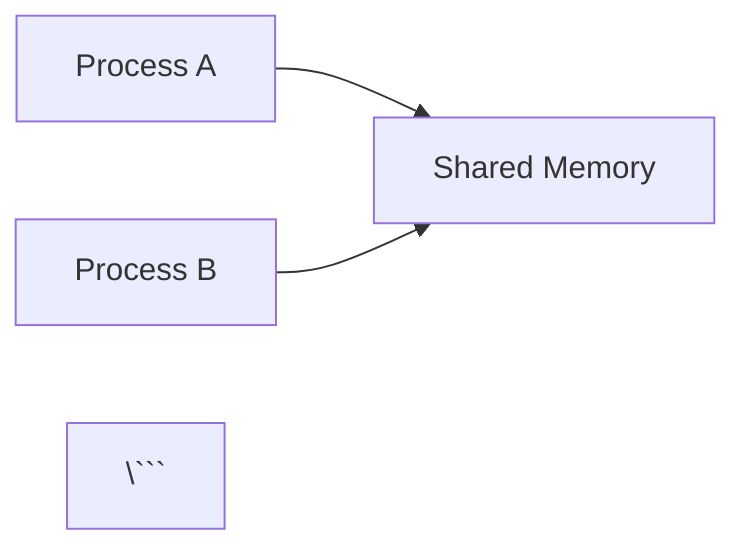

# ZeroIPC Documentation

This directory contains the MkDocs documentation for ZeroIPC.

## Building the Documentation

### Prerequisites

Install MkDocs and dependencies:

```bash
pip install mkdocs mkdocs-material pymdown-extensions mkdocs-minify-plugin
```

### Build and Serve Locally

```bash
# From the repository root
mkdocs serve
```

Then open http://127.0.0.1:8000 in your browser.

### Build Static Site

```bash
mkdocs build
```

Output will be in `site/` directory.

## Documentation Structure

```
docs/
├── index.md                    # Homepage
├── getting-started/            # Installation and quick start
│   ├── index.md
│   ├── installation.md
│   ├── quick-start.md
│   └── concepts.md
├── tutorial/                   # Step-by-step tutorial
│   ├── index.md
│   ├── first-shared-memory.md
│   ├── arrays.md
│   ├── queues-stacks.md
│   ├── streams.md
│   ├── synchronization.md
│   └── advanced-patterns.md
├── cli/                        # CLI tool documentation
│   ├── index.md
│   ├── basic-commands.md
│   ├── virtual-filesystem.md
│   ├── structure-inspection.md
│   └── monitoring.md
├── api/                        # API reference
│   ├── index.md
│   ├── cpp/                    # C++ API
│   ├── python/                 # Python API
│   └── c/                      # C API
├── architecture/               # Architecture and internals
│   ├── index.md
│   ├── binary-format.md
│   ├── design-principles.md
│   ├── lock-free.md
│   ├── memory-layout.md
│   └── testing.md
├── examples/                   # Real-world examples
│   ├── index.md
│   ├── cross-language.md
│   ├── producer-consumer.md
│   ├── sensor-data.md
│   ├── reactive-processing.md
│   └── analytics.md
├── best-practices/             # Best practices
│   ├── index.md
│   ├── performance.md
│   ├── pitfalls.md
│   ├── type-safety.md
│   ├── error-handling.md
│   └── testing.md
├── advanced/                   # Advanced topics
│   ├── index.md
│   ├── codata.md
│   ├── lock-free-patterns.md
│   ├── memory-ordering.md
│   └── custom-structures.md
└── contributing/               # Contribution guide
    ├── index.md
    ├── setup.md
    ├── new-language.md
    └── testing.md
```

## Contributing to Documentation

### Writing Guidelines

1. **Be Clear** - Use simple language, avoid jargon
2. **Be Complete** - Include examples and edge cases  
3. **Be Correct** - Test all code examples
4. **Be Consistent** - Follow existing style

### Code Examples

Use tabs for multi-language examples:

```markdown
=== "C++"
    ```cpp
    zeroipc::Memory mem("/demo", 1024*1024);
    ```

=== "Python"
    ```python
    mem = Memory("/demo", 1024*1024)
    ```
```

### Admonitions

Use admonitions for callouts:

```markdown
!!! note "Important"
    This is a note.

!!! warning "Be Careful"
    This is a warning.

!!! tip "Pro Tip"
    This is a tip.
```

### Diagrams

Use Mermaid for diagrams:

```markdown


## Deployment

### GitHub Pages

Deploy to GitHub Pages:

```bash
mkdocs gh-deploy
```

### Custom Hosting

Build and copy the `site/` directory to your web server:

```bash
mkdocs build
rsync -av site/ user@server:/var/www/zeroipc-docs/
```

## Documentation Status

Current status: **Complete structure with comprehensive index pages**

### Completed
- ✅ Site configuration (mkdocs.yml)
- ✅ Homepage (index.md)
- ✅ Getting Started section (complete)
- ✅ Tutorial section (index + structure)
- ✅ CLI Tool guide (complete)
- ✅ API Reference (index + structure)
- ✅ Architecture (index + structure)
- ✅ Examples (index + structure)
- ✅ Best Practices (index + structure)
- ✅ Advanced Topics (index + structure)
- ✅ Contributing guide (index + structure)

### To Be Completed

Individual tutorial pages (lesson content):
- first-shared-memory.md
- arrays.md
- queues-stacks.md
- streams.md
- synchronization.md
- advanced-patterns.md

Detailed API pages:
- C++ API detailed pages
- Python API detailed pages
- C API detailed pages

Detailed architecture pages:
- binary-format.md (can reference SPECIFICATION.md)
- design-principles.md
- lock-free.md
- memory-layout.md
- testing.md (can reference TESTING_STRATEGY.md)

Detailed example pages:
- cross-language.md
- producer-consumer.md
- sensor-data.md
- reactive-processing.md
- analytics.md

Detailed best practices pages:
- performance.md
- pitfalls.md
- type-safety.md
- error-handling.md
- testing.md

Detailed advanced pages:
- codata.md (can reference codata_guide.md)
- lock-free-patterns.md
- memory-ordering.md
- custom-structures.md

Contributing pages:
- setup.md
- new-language.md
- testing.md

**Note:** Many of these can be created by adapting existing documentation in the `docs/` folder and README files.

## Quick Reference

### Local Development

```bash
# Install dependencies
pip install mkdocs mkdocs-material pymdown-extensions mkdocs-minify-plugin

# Serve locally (auto-reload on changes)
mkdocs serve

# Build for production
mkdocs build

# Deploy to GitHub Pages
mkdocs gh-deploy
```

### File Locations

- **Config**: `mkdocs.yml` (root)
- **Source**: `docs/` (root)
- **Output**: `site/` (generated)
- **Styles**: `docs/stylesheets/extra.css`

## Getting Help

- **MkDocs Documentation**: https://www.mkdocs.org
- **Material Theme**: https://squidfunk.github.io/mkdocs-material/
- **ZeroIPC Issues**: https://github.com/yourusername/zeroipc/issues
