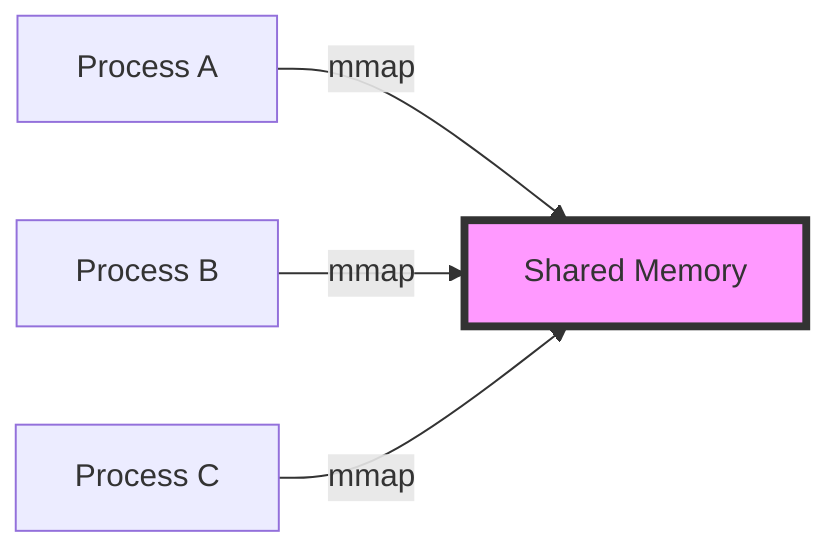

# Basic Concepts

Understanding these core concepts will help you use ZeroIPC effectively and avoid common pitfalls.

## Shared Memory Fundamentals

### What is Shared Memory?

Shared memory is a region of RAM that multiple processes can access simultaneously. Unlike message passing (pipes, sockets), shared memory provides:

- **Zero-copy**: Data stays in one place, no copying between processes
- **Direct access**: Read/write like normal memory
- **High performance**: Nanosecond latency vs microseconds for IPC



### POSIX Shared Memory

ZeroIPC uses POSIX shared memory (`shm_open`, `mmap`):

- **Named segments**: Global names like "/sensor_data"
- **File-backed**: Lives in `/dev/shm` on Linux
- **Persistent**: Survives process crashes
- **Permissions**: Standard Unix file permissions

!!! tip "Listing Shared Memory"
    On Linux, shared memory appears as files:
    ```bash
    ls -lh /dev/shm
    ```

## ZeroIPC Architecture

### Memory Layout

Every ZeroIPC shared memory segment has this structure:

```
+------------------+  ← Offset 0
| Table Header     |  16 bytes: magic, version, entry_count, next_offset
+------------------+
| Table Entry 0    |  40 bytes: name[32], offset, size
+------------------+
| Table Entry 1    |  40 bytes
+------------------+
| ...              |
+------------------+  ← First structure offset
| Structure 1      |  Variable size
| (e.g., Array)    |
+------------------+
| Structure 2      |  Variable size
| (e.g., Queue)    |
+------------------+
| ...              |
+------------------+
```

### Metadata Table

The **metadata table** is the registry of all structures in shared memory:

#### Table Header
```c
struct TableHeader {
    uint32_t magic;         // 0x5A49504D ('ZIPM')
    uint32_t version;       // Format version (currently 1)
    uint32_t entry_count;   // Number of registered structures
    uint32_t next_offset;   // Where to allocate next structure
};
```

#### Table Entry
```c
struct TableEntry {
    char     name[32];      // Structure name (null-terminated)
    uint32_t offset;        // Offset from memory start
    uint32_t size;          // Total allocated size
};
```

!!! info "Minimal Metadata"
    Notice what's **NOT** stored: no type information! This enables language independence—each language interprets data using its own type system.

### Table Size Configuration

Tables have a fixed maximum number of entries, configured at creation:

```cpp
// C++ offers predefined sizes
zeroipc::memory<table64> mem1(...);    // 64 entries (default)
zeroipc::memory<table256> mem2(...);   // 256 entries
zeroipc::memory<table1024> mem3(...);  // 1024 entries
```

Available sizes: `table1`, `table4`, `table8`, `table16`, `table32`, `table64`, `table128`, `table256`, `table512`, `table1024`, `table2048`, `table4096`.

!!! warning "Entry Limit"
    Once the table is full, you cannot create more structures! Choose table size based on expected structure count.

## Core Concepts

### 1. Memory Segments

A memory segment is a named region of shared memory:

```cpp
// Create or open "/sensor_data" with 10MB
zeroipc::Memory mem("/sensor_data", 10*1024*1024);
```

**Key points:**
- Name must start with "/"
- Size is rounded up to page size (typically 4KB)
- First process creates, others open existing
- Persists until explicitly deleted or system reboot

### 2. Data Structures

Structures are allocated within a memory segment:

```cpp
zeroipc::Memory mem("/data", 1*1024*1024);
zeroipc::Array<float> temps(mem, "temperatures", 1000);
zeroipc::Queue<int> tasks(mem, "task_queue", 100);
```

**Key points:**
- Each structure has a unique name (max 31 characters)
- Allocated from the memory segment
- Registered in the metadata table
- Discoverable by other processes

### 3. Duck Typing

ZeroIPC uses **duck typing**—no type information is stored:

```cpp
// C++ creates as int array
zeroipc::Array<int> numbers(mem, "data", 100);
```

```python
# Python must specify correct type
numbers = Array(mem, "data", dtype=np.int32)  # Correct!
numbers = Array(mem, "data", dtype=np.float32)  # Wrong type!
```

**Your responsibility:**
- Ensure type consistency across languages
- Match type sizes (C++ `int` ≈ Python `np.int32`)
- Document shared data types

### 4. Structure Discovery

Processes can discover existing structures:

```cpp
// Process A creates
zeroipc::Array<float> temps(mem, "temps", 1000);

// Process B discovers and accesses
// (if it knows the type and capacity)
zeroipc::Array<float> temps(mem, "temps", 1000);
```

```python
# Python process discovers
temps = Array(mem, "temps", dtype=np.float32)
```

### 5. Lock-Free Operations

Most structures use **lock-free algorithms**:

```cpp
// Queue uses CAS (Compare-And-Swap)
queue.enqueue(value);  // Lock-free, safe from multiple threads
```

**Benefits:**
- No deadlocks
- No priority inversion
- Scalable across cores
- Progress guarantees

**Trade-offs:**
- More complex implementation
- May retry on contention
- Requires atomic operations

## Type System

### C++ Types

C++ uses templates for compile-time type safety:

```cpp
zeroipc::Array<int> ints(mem, "ints", 100);
zeroipc::Array<double> doubles(mem, "doubles", 100);
zeroipc::Queue<MyStruct> queue(mem, "queue", 50);
```

**Requirements:**
- Types must be **trivially copyable** (no pointers, virtual functions, etc.)
- Use POD (Plain Old Data) types
- Padding may affect cross-language use

### Python Types

Python uses NumPy dtypes for type specification:

```python
# Basic types
ints = Array(mem, "ints", dtype=np.int32)
floats = Array(mem, "floats", dtype=np.float64)

# Structured arrays
dtype = np.dtype([('x', np.float32), ('y', np.float32), ('z', np.float32)])
points = Array(mem, "points", dtype=dtype)
```

### Type Mapping

| C++ | Python (NumPy) | Size |
|-----|----------------|------|
| `int8_t` | `np.int8` | 1 byte |
| `uint8_t` | `np.uint8` | 1 byte |
| `int16_t` | `np.int16` | 2 bytes |
| `uint16_t` | `np.uint16` | 2 bytes |
| `int32_t` | `np.int32` | 4 bytes |
| `uint32_t` | `np.uint32` | 4 bytes |
| `int64_t` | `np.int64` | 8 bytes |
| `uint64_t` | `np.uint64` | 8 bytes |
| `float` | `np.float32` | 4 bytes |
| `double` | `np.float64` | 8 bytes |

!!! warning "Platform-Dependent Types"
    Avoid `int`, `long`, `size_t` in cross-language scenarios—use fixed-width types like `int32_t`, `int64_t`.

## Synchronization

### Atomic Operations

Arrays support atomic read-modify-write:

```cpp
zeroipc::Array<int> counter(mem, "counter", 1);

// Atomic increment
int old = counter.fetch_add(0, 1);  // Atomically add 1 to counter[0]
```

### Synchronization Primitives

ZeroIPC provides cross-process synchronization:

```cpp
// Semaphore for mutual exclusion
zeroipc::Semaphore mutex(mem, "mutex", 1);
mutex.acquire();  // Lock
// Critical section
mutex.release();  // Unlock

// Barrier for synchronization points
zeroipc::Barrier barrier(mem, "sync", 4);  // 4 participants
barrier.wait();  // All 4 must reach this point

// Latch for one-time countdown
zeroipc::Latch ready(mem, "ready", 4);
ready.count_down();  // Each worker counts down
ready.wait();  // Main thread waits for all
```

## Memory Management

### Allocation

Memory is allocated using **bump allocation**:

```cpp
zeroipc::Memory mem("/data", 1*1024*1024);  // 1MB total

// Each allocation moves next_offset forward
zeroipc::Array<int> a1(mem, "a1", 100);    // Uses 400 bytes
zeroipc::Array<int> a2(mem, "a2", 200);    // Uses 800 bytes
// ... until memory is exhausted
```

**Characteristics:**
- O(1) allocation time
- No fragmentation during allocation
- **No deallocation**—structures persist

!!! warning "No Deallocation"
    ZeroIPC does not support deleting individual structures. To reclaim space, delete the entire segment.

### Cleanup

Shared memory persists until explicitly removed:

```bash
# List segments
ls /dev/shm

# Remove segment
rm /dev/shm/sensor_data
```

Or programmatically:

```cpp
// C++
zeroipc::Memory::unlink("/sensor_data");
```

```python
# Python
Memory.unlink("/sensor_data")
```

## Best Practices

### 1. Name Your Segments Clearly

```cpp
// Good
zeroipc::Memory sensor_data("/sensor_data", size);
zeroipc::Memory user_cache("/app_user_cache", size);

// Bad
zeroipc::Memory m("/x", size);
zeroipc::Memory data("/data", size);  // Too generic
```

### 2. Document Your Types

Create a header shared between languages:

```cpp
// shared_types.h
struct SensorReading {
    float temperature;
    float humidity;
    uint64_t timestamp;
};
```

```python
# shared_types.py
SENSOR_READING_DTYPE = np.dtype([
    ('temperature', np.float32),
    ('humidity', np.float32),
    ('timestamp', np.uint64),
])
```

### 3. Choose Appropriate Table Sizes

```cpp
// Few structures (< 10)
zeroipc::memory<table16> mem(...);

// Moderate (10-50)
zeroipc::memory<table64> mem(...);  // Default

// Many (100+)
zeroipc::memory<table256> mem(...);
```

### 4. Handle Errors

```cpp
// Check if structure exists
if (auto arr = zeroipc::Array<int>::open(mem, "data")) {
    // Use arr
} else {
    // Doesn't exist, create it
    zeroipc::Array<int> arr(mem, "data", 100);
}
```

### 5. Clean Up Test Memory

```bash
# In tests, use unique names
std::string name = "/test_" + std::to_string(getpid());
```

## Next Steps

Now that you understand the fundamentals:

- **[Tutorial](../tutorial/index.md)** - Hands-on guide to each structure
- **[Architecture](../architecture/index.md)** - Deep dive into internals
- **[Best Practices](../best-practices/index.md)** - Tips and pitfalls
